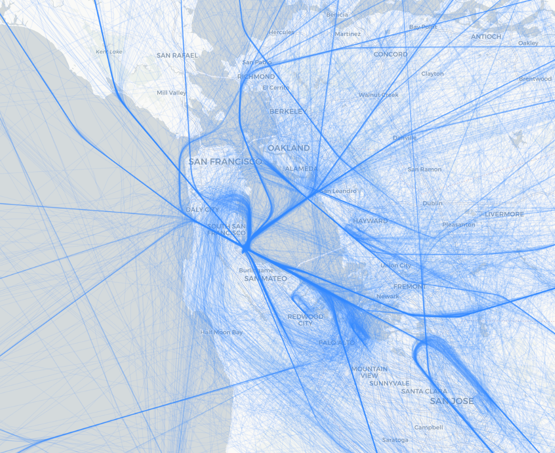

# atcmonitor

ATCMonitor is a tool for creating visual maps of what air traffic controllers are doing. It is designed to help visualize the flow of air traffic and the activities of air traffic controllers in a given area.

## Features

- Visualize air traffic controller activities
- Create maps of air traffic control operations
- Log and analyze air traffic data, including VHF and ADS-B data
- Support for multiple data sources
- Validate and process air traffic data, alerting controllers to potential issues

## Screenshots

### KSFO (San Francisco International Airport)

#### Tracks
Visual representation of aircraft tracks around San Francisco International Airport (KSFO).

Darker lines indicate commonly used flight paths, while lighter lines represent less frequently used paths.

#### Clustering

To determine when an aircraft is on a common flight path, the tool clusters aircraft tracks. This helps in identifying patterns and common routes taken by aircraft.

Blue indicates high precision, while red indicates low precision but very frequent paths. Generally, red regions signal departure and arrive coordination by air traffic controllers or pilots, while blue regions are used for high precision, en route traffic.

Rules can then be written to alert controllers when aircraft deviate from these common paths, helping to maintain safety and efficiency in air traffic control operations. By default, aircraft within 5-mile radius of an airport must be within a valid cluster; otherwise an alert is generated.

## Credits

This repository uses `dump1090` for decoding live ADS-B data and `RTLSDR-Airband` for decoding live VHF data.

Historical data is provided by the [OpenSky Network](https://opensky-network.org/), which offers a large dataset of air traffic control data.

